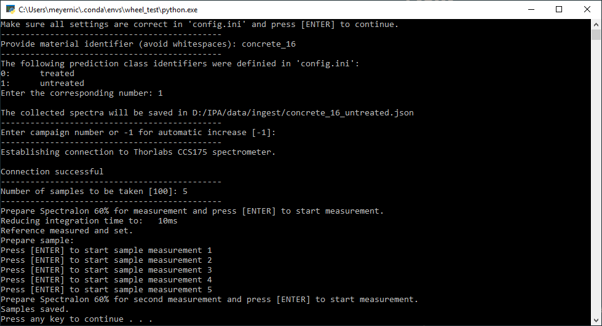

Acquire Training Data
=====================

This step allows the user to generate the spectral training data for a given material or material 
property. The spectral training data is saved in separate files per *material identifier* and 
*predicition class* using the *JSON* format in the *ingest folder* which is defined in the `config` file.

Before running the script, make sure that the `config` file is configured correctly, that the 
**Spectrometer** is connected to the PC and that there is **no** open instance of *Thorlabs OSA*, 
as this would block our connection.

Run :file:`repo/scripts/01_generate_training_data.py`. 

A *Command Line Interface* will open and the user will be prompted to enter additionally needed 
information:

Material identifier: 
   This is the name/identifier of the sample and should **not** contain the prediction class.

Prediciton class number:
   This number corresponds to the prediction classes defined in the `config` file.

Campaign number: *(Default value: -1)*
   This number is used to separate the epochs of data collection, in case the same material 
   and prediction class is sampled at multiple times. For -1 the last campaign number within the 
   corresponding *JSON* file increased by 1 will be used. If no *JSON* file exists yet, it will 
   be set to 1.

Number of samples: *(Default value: 100)*
   This number defines the number of samples to be taken in the current campaign.

   Command Line Interface of *01_generate_training_data.py*

These steps need to be repeated for each material sample.