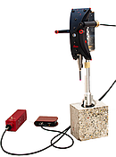

==================================================================
Spatially Referenced Spectroscopy for Material Probing (**SRSMP**)
==================================================================
**SRSMP** is a Python-based library that offers a framework, in conjunction with the software 
`SpatialAnalyzer <https://www.kinematics.com/spatialanalyzer/index.php>`_. by New River Kinematics, 
to generate 3D maps of material properties.
The hardware used in this implementation is the following:

- `Leica Absolute Tracker AT960 <https://www.hexagonmi.com/en-US/products/laser-tracker-systems/leica-absolute-tracker-at960>`_
- `Thorlabs Compact Spectrometer CCS175 <https://www.thorlabs.com/thorproduct.cfm?partnumber=CCS175#ad-image-0>`_

.. toctree::
   :caption: User Guide:
   :maxdepth: 3

   self
   content/installation
   content/howto
   

Indices and tables
==================

* :ref:`genindex`
* :ref:`modindex`
* :ref:`search`
